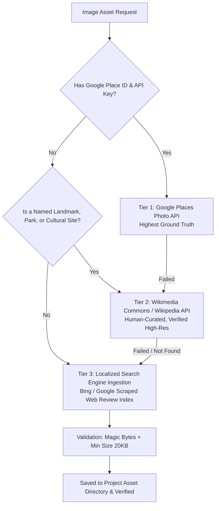

# Fetch Mockup Image Assets

A standardized, objective methodology and automated tooling to source **ground-truth, culturally and domain-accurate image assets** for UI mockups, catalogs, and travel prototypes.

---

## 1. The Core Problem: Why Generic Stock Fails

When building mockups for specific real-world domains (e.g., regional tourism, ethnic cuisines, historical monuments, local merchants):

> [!CAUTION]
> **The Stock Photo Trap:**
> Sourcing from general stock photography platforms (Unsplash, Pexels, Pixabay) silently degrades mockups with inaccurate placeholders because general stock libraries lack geo-specific cultural items.
> - **Institut Teknologi Bandung (ITB)** falls back to a generic American or European college hall.
> - **Kawah Putih (Ciwidey)** falls back to Crater Lake in Oregon.
> - **Cuanki Serayu (Bandung)** falls back to Japanese ramen or Vietnamese pho.
> - **Tahu Sumedang** falls back to generic Western tofu salad.

This breaks user trust and destroys realism in design presentations and client demos.

---

## 2. The 3-Tier Objective Hierarchy

Always resolve images using this strict 3-tier priority ladder:



### Tier 1: Google Places Photo API (Google Maps Ground Truth)
- **Best For:** Brick-and-mortar restaurants, cafes, verified landmarks with a known `placeId`.
- **Method:** Calls Google Places API `places/{placeId}?fields=photos` and fetches the top visitor-rated hero photo.
- **Result:** Identical to what a user sees when opening Google Maps on their phone.

### Tier 2: Wikimedia Commons & Wikipedia PageImages API (Curated Heritage)
- **Best For:** Historical landmarks, government palaces, nature reserves, volcanoes, museums.
- **Endpoint:** `https://{lang}.wikipedia.org/w/api.php?action=query&titles={Title}&prop=pageimages&format=json&pithumbsize=1200`
- **Result:** High-resolution, copyright-cleared, human-reviewed photographs by cultural preservationists (e.g. official photos of ITB Aula Barat, Gedung Sate, Monas, Kawah Putih).

### Tier 3: Localized Search Engine Image Scraping (Food & Local Stalls)
- **Best For:** Regional street food stalls, warungs, specialty dessert shops without Wikipedia articles.
- **Method:** Automated image search querying the exact localized name + regional context (e.g., `"Batagor & Cuanki Serayu Bandung"`, `"Tahu Sumedang cabe rawit"`, `"Soto Betawi Haji Mamat"`).
- **Result:** Sourced directly from authentic food journalism and review platforms (DetikFood, Kompas, PergiKuliner, TravelingYuk).

---

## 3. Automated Tooling (`scripts/fetch_asset.py`)

This skill provides an automated Python CLI script located at:
`scripts/fetch_asset.py`

### Single Asset Fetch
```bash
uv run python scripts/fetch_asset.py \
  --query "Institut Teknologi Bandung Aula Barat" \
  --out "public/images/bandung/itb.jpg"
```

### With Context Hint (for ambiguous or common names)
```bash
uv run python scripts/fetch_asset.py \
  --query "Kawah Putih" \
  --context "Ciwidey Bandung" \
  --out "public/images/bandung/kawahputih.jpg"
```

### Batch Ingestion Manifest
For multi-site catalogs, create a JSON manifest:
```json
[
  {
    "query": "Soto Betawi Haji Mamat",
    "context": "Jakarta Betawi soup",
    "out": "public/images/sotobetawi.jpg"
  },
  {
    "query": "Cuanki Serayu Bandung",
    "context": "bakso cuanki",
    "out": "public/images/bandung/cuanki.jpg"
  }
]
```
Execute batch:
```bash
uv run python scripts/fetch_asset.py --manifest manifest.json
```

---

## 4. Verification Protocol

After downloading assets:
1. **Integrity Validation:** The script automatically validates:
   - File size > 15–20 KB (rejecting corrupted files, icons, or tiny 1x1 tracking pixels).
   - Magic bytes header (`\xFF\xD8\xFF` for JPEG, `\x89PNG` for PNG, `RIFF...WEBP` for WebP).
2. **Visual Inspection Table:** Generate an artifact markdown table and/or interactive HTML gallery displaying:
   - Destination / Item name
   - Thumbnail preview (loading from disk or live deployment)
   - Asset file path and dimensions
   - Brief cultural/domain description
3. **User Sign-Off:** Always invite the user to visually inspect the rendered table/gallery before final sign-off.
